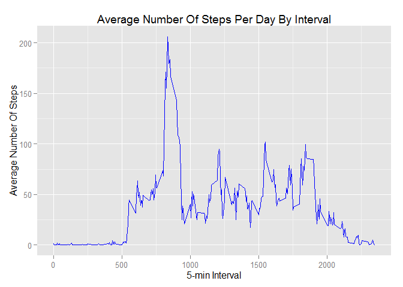
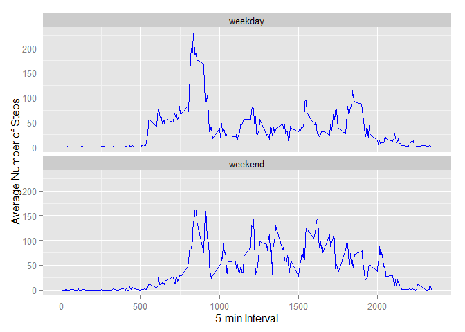

# Reproducible Research: Peer Assessment 1
David Li  
September 16, 2015  

## Loading and preprocessing the data

```r
library(ggplot2)
actData <- read.csv("data/activity.csv");
actData$date <- as.Date(actData$date, "%Y-%m-%d")
```

## What is mean total number of steps taken per day?
Aggregate the summary data and create histogram chart

```r
aggSum <- aggregate(steps ~ date, data=actData, na.rm = T, sum);
hist(aggSum$steps, main = "Total Steps By Day", xlab = "Number Of Steps", col = "red");
```

 

Calculate mean and median

```r
mean1 <- mean(aggSum$steps);
median1 <- median((aggSum$steps));
mean1
```

```
## [1] 10766.19
```

```r
median1
```

```
## [1] 10765
```

## What is the average daily activity pattern?
Aggregate average data

```r
aggAvg <- aggregate(steps ~ interval, data=actData, na.rm = T, mean)
```

Use ggplot to create time series plot

```r
ggplot(data = aggAvg, aes(x = interval, y = steps), geom = c("point","smooth") ) + 
  geom_line(col="blue") + 
  labs(title="Average Number Of Steps Per Day By Interval", x="5-min Interval",
    y="Average Number Of Steps")
```

 

Calculate Which 5-minute interval contains the maximum number of steps

```r
aggAvg[which.max(aggAvg$steps),1]
```

```
## [1] 835
```

## Imputing missing values
Calculate total number of missing values

```r
sum(is.na(actData$steps))
```

```
## [1] 2304
```
Fill in all of the missing values with the mean for that 5-minute interval

```r
actDataImputed <- within(actData, steps <- ifelse(!is.na(steps), steps,
    aggAvg[match(interval,aggAvg[,1]),2]))
```

Create Histogram for imputed data. 

```r
aggSumImputed <- aggregate(steps ~ date, data=actDataImputed, sum)
hist(aggSumImputed$steps, main = "Total Steps By Day", xlab = "Number Of Steps", col = "blue")
```

 

Calculate new mean and median for imputed data. 

```r
meanImputed <- mean(aggSumImputed$steps);
medianImputed <- median((aggSumImputed$steps));
meanImputed
```

```
## [1] 10766.19
```

```r
medianImputed
```

```
## [1] 10766.19
```

* The mean difference between imputed and non-imputed is 0
* The median difference between imputed and non-imputed is 1.1886792

* What is the impact of imputing missing data on the estimates of the total daily number of steps?
After comparing the two histograms, it seems that the impact of imputing missing values has increase histogram peak. 


## Are there differences in activity patterns between weekdays and weekends?
Create a new factor variable in the dataset with two levels - "weekday" and "weekend" indicating whether a given date is a weekday or weekend day.

```r
actDataImputed <- within(actDataImputed, 
  dayOfWeek <- ifelse(weekdays(as.Date(date)) %in% c("Saturday","Sunday"), "weekend","weekday"))
```

Make a panel plot containing a time series plot of the 5-minute interval (x-axis) and the average number of steps taken, averaged across all weekday days or weekend days (y-axis)

```r
aggAvgImputed <- aggregate(steps ~ interval + dayOfWeek, data=actDataImputed, na.rm = T, mean)

ggplot(aggAvgImputed, aes(x=interval, y=steps)) + 
  geom_line(color="blue") + 
  facet_wrap(~ dayOfWeek, nrow=2, ncol=1) +
  labs(x="5-min Interval", y="Average Number of Steps")
```

 
The graph above shows that activity on the weekday has the greatest peak from all steps intervals.
